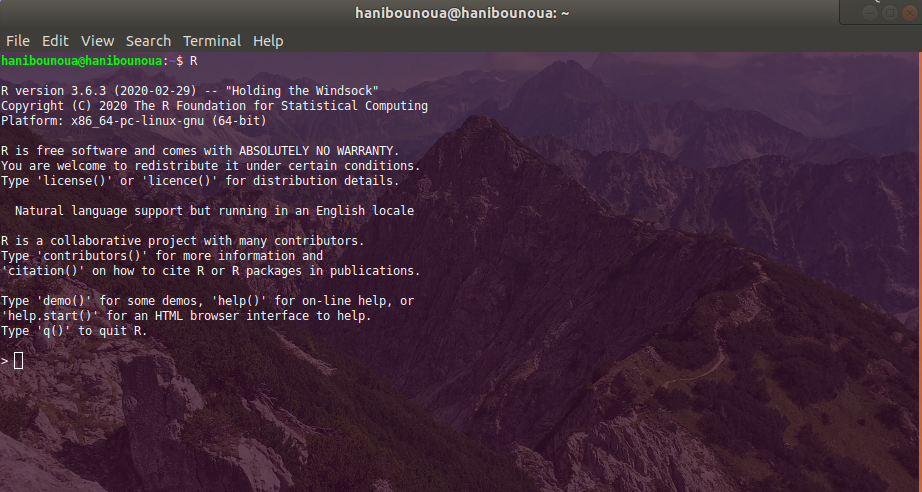

## Introduction :

R est un langage de programmation utiliser dans les analyses statistiques, créer en août 1993. Il est :

* Interprété.
* Orientée objet.
* Open source, et gratuit.
* Multi-plateforme.


### Interface :

Programmer en langage R, requière en premier l'installation de l'**interpréteur R**, et d'un IDE (Integrated Developpement Envirement). Dans cette formation, nous allons travailler avec **RStudio**, un IDE gratuit et open source. On peut les télécharger gratuitement des liens ci-dessous.


* [**Interpréteur R**](https://cran.r-project.org/).
* [**RStudio**](https://rstudio.com/).


La figure ci-dessous represente la console R sur Ubuntu/GNU-Linux.



La figure ci-dessous represente l'interface de l 'IDE (Integrated Developpement Envirement). 


### Les Notion de base:

#### Les objets Dans R:

R étant un langage orienté objet, les composantes de base de ce langage sont des objets. On distingue plusieurs **classes** d'objets :

| Classe | Description| Valeurs |
|:--------:|:------------:|:-------------------:|
| `r class(2.2)` | Les nombres réelles | ...`-1`, `-0.4`, `0`,`1`, `2` ... |
| `r class(2L)`| Les Nombres entiers | ... `-2L`, `-1L`, `0L`, `1L`, `2L` ...|
| `r class(4+2i)` | Les nombres complexes| ... `4+2i`, `3+4i` ...|
| `r class('Formation R')` | Les chaînes de caractères| `"Hello World!!!"`...|
| `r class(TRUE)` | Les booléens| `TRUE` ou `T`, `FALSE` ou `F`|

Donc R nous permet en premier lieu de manipuler ces objets, nous allons aborder la notion d'opérateurs, qui nous permettent de manipuler ces objets. On distingue deux types d'opérateur.

1. Les Opérateurs Arithmétique ; ces opérateurs nous permettent de manipuler des nombres (entiers, réelles, complexes).
2. Les Opérateurs Logique ; vont nous permettre de faire des tests (une opération dont le résultat et vrai ou faux, dans ce cas `TRUE` ou `FALSE`), et donc d'opérer sur des booléens.

##### Les opérateurs Arithmétiques:

La première chose qu'on peut remarquer, c'est que R est une calculatrice, qui est est plus puissante plus précise et plus rapide que n'importe quelle autre calculatrice. Le tableau ci-dessous contient les descriptions de chaque opérateur arithmétiques, ainsi que des exemples:

| Opérateur | Description | Exemple | Résultat |
|:--------:|:------------:|:-------------------:|:----------------:|
| `+` | L'addition | `2 + 3` | `r 2 + 3`| 
| `-`| La soustraction | `2 - 3` | `r 2 - 3` |
| `*` | La multiplication | `4 * 3` | `r 4 * 3` | 
| `/` | La division | `5 / 2` | `r 5 / 2` |
| `%%` | Le reste de division | `5 %% 2` | `r 5 %% 2` | 
| `%/%` | Le quotient de la division | `5 %/% 2` | `r 5 %/% 2` |
| `^` ou `**` | La puissance | `2 ^ 3` où `2 ** 3` | `r 2 ^ 3` |


##### Les opérateurs logiques:

Ces opérateurs sont très importants en programmation ; dans des structures de code qu'on appelle les structures conditionnelles et qu'on va voir un peu plus loin, mais aussi en statistiques ; dans ce qu'on appelle les filtres, *avec un peu de structures conditionnelles*. Ci-dessous,  ce tableau contient les descriptions de chaque opérateur logiques, ainsi que des exemples:


| Opérateur | Description | Exemple | Résultat |
|:--------:|:------------:|:-------------------:|:----------------:|
| `==` | Le test d'égalité | `10 == 10` | `r 10 == 10`| 
| `!=`| Le test de différence | `2 != 3` | `r 2 != 3` |
| `>` | Le test de supériorité stricte | `4 > 3` | `r 4 > 3` | 
| `>=` | Le test supérieur ou ègale | `4 >= 4` | `r 4 >= 3` | 
| `<` | Le test de infériorité stricte | `4 < 3` | `r 4 < 3` | 
| `<=` | Le test inférieur ou ègale | `4 <= 4` | `r 4 <= 4` | 
| `!` | La négation | `!(4 < 3)` | `r !(4 < 3)` |
| `&` ou `&&` | La conjonction (le **et** logique) | `2 < 3 & 4 > 3` ou `2 < 3 && 4 > 3` | `r 2 < 3 && 4 > 3` |
| `|` ou `||` | La disjonction (le **ou** logique) | `2 > 3 | 2 > 1` ou `2 > 3 || 2 > 1` | `r 2 > 3 | 2 > 1` |
| `xor(,)` | Le **ou exclusif**| `xor(2 < 3, 2 > 1)` | `r xor(2 < 3, 2 > 1)` |


Il existe d'autres opérateurs, que l'on va voir plus loins dans la formation.


#### Les variables :
À ce niveau de cette formation, vous savez faire des calculs avec R, qui peuvent être plus ou moins complexe. Mais si je fais un traitement qui exige de moi de faire une succession d'opérations sur des données, il est judicieux de stocker mes données quelque part, pour des soucis de reproductibilité. Et la notion de variable en programmation sert à ça. Une Variable est caractérisée par deux attributs :

1. Le nom de la variable ; c'est ce qui va nous permette d'accéder à la donnée. Le nom d'une variable ne peut pas contenir :
    + les caractères spéciaux ; \,/,@,-,+,~,&,#,...etc.
    + les caractères accentués ; é,ù,ê,à,...etc.
    + ne peux pas commencer par un chiffre.
    + ne peut pas avoir un mot, spécial dans R.
2. La Valeur ou la donnée.


Pour stocker une données dans une variable, on utilise un opérateur d'affectation, il existe dans R deux opérateurs d'affectations :

* ` = ` ; c'est le moins utilisé.
* ` <- ` ; On utilise souvent cet opérateur.

**Exemple**:

```{r}
ma_premiere_variable <- "hello world!!!!" 
maPremiereVariable <- 12
maDeuxiemeVariable <- 10
leResultat <- maPremiereVariable - maDeuxiemeVariable
leResultat
```


#### Les Conteneurs :


Un conteneur est une collection de données, on peut le stocker dans une variable. Dans le langage R, on distingue quatre types de conteneur. Chaque type a des propriétés.


##### Les Vecteurs :

un vecteur est caractérisé pas deux propriétés principales:

1. Il est caractérisé par le type d'objet qu'il contient, et ne peut pas contenir des objets de différents type.
2. Il est aussi caractérisé par sa longueur.


**Exemple**:

```{r}
monPremierVecteur <- c(1, 4, 2, 3)
testHeteroGene <- c(1, "R", TRUE)
length(monPremierVecteur)
monPremierVecteur[2:4]
monPremierVecteur[2]
```


##### Les matrices :

Une matrice est caractérisé par sa dimension qui est le nombre de ligne et le nombre de collonnes. Et comme pour les vecteur elle ne peut pas contenirdes objets de différents type.

**Exemple**:
```{r}
maPremiereMatrice <- matrix(monPremierVecteur, nrow = 2, ncol = 2, byrow = TRUE)
maPremiereMatrice
maPremiereMatrice[1, 2]
maPremiereMatrice[,2]
maPremiereMatrice[1,]
```
##### Les Listes :

Contrairement aux conteneurs vue precedement les listes, nous permettent de stocker des objets de différents types, `r class('h')`, `r class(2L)`, et même des conteneurs, elles sont caractérisées par leurs longueurs qui est le nombre d'éléments qu'elles contiennent.

**Exemple**:
```{r}
maPremiereListe <- list("Introduction A la Programmation R", 23, TRUE)
maPremiereListe[1]
maPremiereListe[[1]]

maDeuxiemeListe <- list(leTitre = "Introduction A la Programmation R", nombreQlq = 23, Booleen = TRUE)
maDeuxiemeListe$leTitre
```


##### Les data frames :

Les data frames ou tableau de données, ou table de donnée sont semblables aux tableaux sur le logiciel MS Excel, ou SPSS. Ils sont caractérisés pas des colonnes (que l'on appelle en statistiques Variable); qui ont un nom, et par des lignes ; sue l'on appelle des observations. Le croisement entre une ligne et une colonne s'appelle une case ; et elle contents une valeur.

**Exemple**:
```{r}
monPremierDF <- data.frame(Age = c(10, 20, 18, 32), Genre = c("H", "F", "H", "F"))
monPremierDF
monPremierDF[2,]
monPremierDF[1, 2]
monPremierDF[1, "Genre"]
monPremierDF$Genre[1]
```


#### Les fonctions :

Les fonctions dans R sont des variables spéciales, elles sont caractérisées pas un nom, et par des arguments, elles nous permettent d'exécuter des taches (Qui peut être soit un traitement, ou un calcule ; dans ce cas, elle nous retourne une valeur), dans Excel une fonction est appelée formule.


On fait appel à une fonction comme suit :

    <NOM_DE_LA_FONCTION>(<ARG_1> = <VAL_1>, <ARG_2> = <VAL_2>, ...)

**Remarque** :

L'opérateur **ou exclusif**, `xor()` est une fonction elle prend deux arguments booléens, et elle nous retourne une valeur booléenne.


**Important**: 

      La fonction la plus importante en R est; la fonction `help()`, elle prend en arguement le nom d'une fonction et elle nous retourn la d'escription détaillé de cette fonction.

**Exemple**:
```{r}
help(xor)
```


#### Les structures conditionnelles :

Dans des analyses statistiques, la structure conditionnelles qu'on utilise les plus c'est la fonction ; `ifelse()`, elle prend trois arguments que nous allons détailler dans ce qui suit :

```{r}
ifelse(2 < 1, "Deux est effectivement superieur a un", "C 'est faux")
```


**Exemple**:
```{r}

```


### Manipulation des données :

#### Les Packages :

Dans ce qui suit, vous allez voir les différents aspect de la manipulation des données, en premier nous allons voir la notion de **Package**, et nous allons en voir un en particulier le **Tidyverse**.

**Note**: Dans ce qui suit nous allons utiliser l'opérateur pipe: `%>%`, dans la manipulation de donnée avec le paradigme **tidyverse**, il est de vigueur de l'utiliser pour lier les differents etapes dans le traitement des données. 


```{r, eval=FALSE}
install.packages("tidyverse") # Cette commande nous permet d'installer le package Tidyverse.
```


Un package est une sorte de librairie qui contient des fonctions autres que celles, qui viennent avec R base. Pour utiliser ces fonctions, on doit charger le package avec la commande `library("<LE_NOM_DU_PACKAGE>")`.

Le package **Tidyverse** contrairement aux autres package non pas une collection de fonctions mais une collection de packages:

```{r}
library('tidyverse')
```


#### Importer la donnée :

Les données peuvent se trouver sous différentes formes, les plus communes sont :

* Les bases de Données relationnelles.
* Les fichiers .xls et xlsx; classeurs Excel, le package **readxl**.
* Les fichiers .csv.

Souvent on utilise des données sur R, qu'on charge d'un fichier CSV, ou d'une base de données relationnel, la commande qu'on utilise pour lire nos données d'un fichier CSV est, `read_csv` est une fonction du package **readr**:

```{r}
df_1 <- read_csv("./data/time_series_covid19_confirmed_global.csv")
df_2 <- read_csv("./data/time_series_covid19_deaths_global.csv")
df_3 <- read_csv("./data/time_series_covid19_recovered_global.csv")
```

Dans le cas d'un base de données SQL nous avons besoin d'un certain nombre de packages suplementaire, le premier **DBI**, il vas nous permetre de manipuler et modifier notre base de données, mais pour cela nous devons nous connécter a cette base, nous aurons besoin de package associé au  **SGBD** avec lequels nous allons travailer.

* **RMySQL** pour se connecter a une base MySQL et MariaDB
* **RPostgreSQL** pour se connecter a une base Postgres et Redshift.
* **RSQLite** pour se connecter a une base SQLite.
* **odbc** pour se connecter a une base commercial comme Microsoft SQLserver, ou Oracle.
* **bigrquery** pour se connecter a une base BigQuery.

```{r}

con <- DBI::dbConnect(RSQLite::SQLite(), "./data/nycflights13.sqlite")

copy_to(con, nycflights13::airports, "airports", temporary = FALSE)
copy_to(con, nycflights13::flights, "flights", temporary = FALSE)
copy_to(con, nycflights13::airlines, "airlines", temporary = FALSE)
copy_to(con, nycflights13::planes, "planes", temporary = FALSE)
copy_to(con, nycflights13::weather, "weather", temporary = FALSE)

flights_db <- tbl(con, "flights") %>% 
  select(sched_arr_time, arr_delay, carrier, flight, tailnum, origin, dest) %>% 
  dplyr::filter(tailnum == "N14542") %>% 
  show_query()
```
```{r}
flights_db
```

#### Exploration des données:

Pour executer une tache (Transformation, Calcule, Visualisation) sur des données; ces derniere doivent avoir une forme spécifique. Et donc on doit les transformer. pour cela le package **tidyverse** met à notre disposition deux packages: **tidyr** et **dplyr**.

Nous allons parcourir, les fonctions principale de ces packages.

##### Opérations sur la forme de la table:

###### gather ou pivot_longer:

```{r}
confirmed <- df_1 %>% 
  pivot_longer(ends_with("/20"), names_to = "date", values_to = "confirmed")
deaths <- df_2 %>% 
  pivot_longer(ends_with("/20"), names_to = "date", values_to = "death")
recovered <- df_3 %>% 
  pivot_longer(ends_with("/20"), names_to = "date", values_to = "recovered")
```

###### Speard ou pivot_wider:

```{r}
confirmed %>% 
  pivot_wider(names_from = "date", values_from = "confirmed") %>% 
  head(.,10)
```


##### Opérations sur les colonnes:

###### **Renomer les colonnes**:

Nous pouvon le faire de deux façon:

* Automatiser: avec la fonction `clean_names` du package **janitor**.
* Manuellement: avec la fonction `rename` du package **dplyr**. 

```{r}
confirmed <- confirmed %>% 
  rename(Province.State = 'Province/State', Country.Region = 'Country/Region')

deaths <- deaths %>% 
  rename(Province.State = 'Province/State', Country.Region = 'Country/Region')

recovered <- recovered %>% 
  rename(Province.State = 'Province/State', Country.Region = 'Country/Region')

head(confirmed)
```


###### **Selcetionner des colonnes**:

Le package **dplyr** est a R ce qu'est le language **SQL** a un SGBD. il met a notre disposition enormement d'outils comme la fonction `select`.


```{r}

confirmed %>% 
  select(Province.State, Country.Region, date, confirmed) %>% 
  head()


```

###### **Ajouter une nouvelle colonne**:

La fonction nous permetant de le faire est `mutate` du package **dplyr**.

```{r}
confirmed <- confirmed %>% 
  rename(date1 = date) %>% 
  mutate(date = lubridate::mdy(date1)) %>% 
  select(-date1)

deaths <- deaths %>% 
  mutate(date = lubridate::mdy(date))

recovered <- recovered %>% 
  mutate(date = lubridate::mdy(date))
```


##### **Opérations sur les lignes**:

Comme pour `select` et `mutate` le package **dplyr** viens avec pleins d'autres fonctions nous en citerons les plus importantes dans cette section.

1. Les filtre:

Il nous permette de selectionner des lignes qui verifies certaines conditions, la fonction qu'on utilise est `filter`.

```{r}
confirmed %>% 
  dplyr::filter(Country.Region == 'Algeria', confirmed > 0)

```

###### **Arranger les Valeurs**:

Pour explorer les valeurs numerique il est important de les ordonnés afin de verifier si il y a des annomalies. Pour cela on utilise la fonction, `arrange`.

```{r}
library(dplyr)
confirmed %>% 
  arrange(confirmed)
```


###### **Grouper nos données**:

Grouper les données est necessaire quand on veut procéder a une agrégation, substituer les valeurs aberrantes, ou les valeurs manquantes. nous utiliserons la fonction `group_by`.


```{r}
confirmed <- confirmed %>%
  mutate(Province.State = ifelse(test = is.na(Province.State), Country.Region, Province.State)) %>%
  group_by(Province.State) %>%
  arrange(date) %>%
  mutate(daily.cases = confirmed - dplyr::lag(confirmed,1)) %>%
  replace_na(list(daily.cases = 0)) %>%
  ungroup()


deaths <- deaths %>%
  mutate(Province.State = ifelse(test = is.na(Province.State), Country.Region, Province.State)) %>%
  group_by(Province.State) %>%
  arrange(date) %>%
  mutate(daily.death = death - dplyr::lag(death,1)) %>%
  replace_na(list(daily.death = 0)) %>%
  ungroup()


recovered <- recovered %>%
  mutate(Province.State = ifelse(test = is.na(Province.State), Country.Region, Province.State)) %>%
  group_by(Province.State) %>% 
  arrange(date) %>%
  mutate(daily.recovered = recovered - dplyr::lag(recovered,1)) %>%
  replace_na(list(daily.recovered = 0)) %>%
  ungroup()
```

###### **Agrégé les données**:

La derniere fonction que nous allons voir et `summarise`, elle nous permet d'agréger nos données, nous l'utilisons souvant avec `group_by`.


```{r}
confirmed %>% 
  select(date, confirmed) %>% 
  group_by(date) %>% 
  summarise(global.confirmed = sum(confirmed), number = n()) %>% 
  ggplot(mapping = aes(x = date, y = global.confirmed)) +
    geom_line()
```


###### **Joindre plusieurs data frame**:


```{r}
confirmed <- confirmed %>% 
  mutate(Province.State = ifelse(test = is.na(Province.State), Country.Region, Province.State))
deaths <- deaths %>% 
  mutate(Province.State = ifelse(test = is.na(Province.State), Country.Region, Province.State))
recovered <- recovered %>% 
  mutate(Province.State = ifelse(test = is.na(Province.State), Country.Region, Province.State))

all_data <- confirmed %>% 
  left_join(deaths, by = c("Province.State", "Country.Region", "Lat", "Long", "date")) %>%
  left_join(recovered, by = c("Province.State", "Country.Region", "Lat", "Long", "date"))


head(all_data)
```

## Reférences :

1. [**R For Data Science**](https://r4ds.had.co.nz/), par **Garrett Grolemund** et **Hadley Wickham** de *RStudio*.
2. [**RYouWithMe**](https://rladiessydney.org/courses/ryouwithme/), par **Lisa Williams** de *R-Ladies Sydney*.